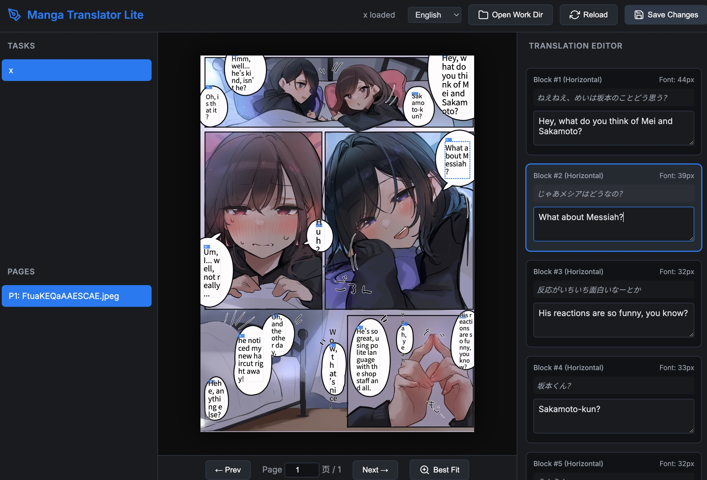

# Manga Image Translator Lite (漫画画像翻訳器ライト)

[English](README.md) | [日本語](README-JP.md) | [中文](README-CN.md)

## 謝辞

本プロジェクトは、**frederik-uni** 氏と **zyddnys** 氏、およびオリジナルプロジェクト [manga-image-translator](https://github.com/zyddnys/manga-image-translator) に深く感謝いたします。この「ライト版」は、オリジナルコードベースを現代化したリファクタリング版であり、高性能な CLI 優先の体験と人間による校正の柔軟性を提供することを目指しています。

## オリジナル版との主な違い

1.  **デカップリングされたパイプライン**: プロセスを `extract` (抽出)、`translate` (翻訳)、`render` (描画) の 3 つのステップに分割。中間結果は `pages.json` に保存され、最終的な描画の前に手動で編集が可能です。
2.  **LLM バッチ処理の最適化**: LLM 向けに再設計。複数のページにまたがるテキストブロックをバッチ処理することで、API コストを大幅に削減し、より適切な文脈での翻訳を可能にします。
3.  **現代化と最適化**: Python 3.10+ と完全に互換性があり、Apple Silicon (MPS/Metal) および NVIDIA (CUDA) 加速向けに最適化されています。
4.  **スマートレンダリング**: 二分探索アルゴリズムを採用し、元の検出境界を尊重しつつ、吹き出し領域を最大限に埋めるフォントサイズを自動的に決定します。
5.  **マルチタスクサポート**: `in/` 以下のサブディレクトリを個別の「タスク」として自動的に処理し、クリーンなワークスペース構造を維持します。
6.  **インクリメンタル翻訳**: 指定したページからの再開や、翻訳済みブロックのスキップに対応し、時間とコストを節約します。

---

ローカル OCR + サードパーティ LLM API。パイプラインは 3 つのステップに分かれており、翻訳結果を画像に書き戻す前に手動で編集することができます。

```text
  in/                                   work/                              out/
  ├── manga_a/                          ├── manga_a/                       ├── manga_a/
  │   ├── 0001.jpg  ── extract ──▶    │   ├── pages.json  ── render ──▶ │   ├── 0001.png
  │   └── 0002.jpg                     │   └── clean/                     │   └── 0002.png
  └── manga_b/                          └── manga_b/                       └── manga_b/
      ├── 0001.jpg                          ├── pages.json                     ├── 0001.png
      └── 0002.jpg                          └── clean/                         └── 0002.png
                                                  ▲
                                                  │ translate (LLM API)
                                                  │ + 手動編集 (ビジュアルエディタ)
```

`in/` 以下の各サブディレクトリは独立した**タスク**として扱われます。ディレクトリ構造は `work/` と `out/` にミラーリングされます。テキストが検出されなかった画像はそのまま出力されます。

## 手順

| ステップ | 内容 | 出力 |
|---|---|---|
| `extract` | テキスト検出 → OCR → マスク精査 → インペイント | `work/<タスク>/clean/*.png`, `work/<タスク>/pages.json` |
| `translate` | テキストを約 1500 文字のバッチにまとめ、LLM を呼び出し。インクリメンタル更新をサポート。 | 各タスクの更新された `pages.json` |
| `render` | スマートな写植を用いて、翻訳されたテキストを画像に描画 | `out/<タスク>/*.png`（入力と同数） |
| `run` | 抽出 → 翻訳 → 描画を一括実行 | ワークスペースと最終画像の両方 |

各タスクの `pages.json` は唯一の信頼できる情報源です。`translate` と `render` の間にこれを開いて、翻訳を修正することができます。

## クイックスタート

```bash
pip install -r requirements.txt          # Python >= 3.10 推奨
cp examples/Example.env .env             # OPENAI_API_KEY または GEMINI_API_KEY を追加

# エンドツーエンド実行
python -m manga_translator_lite run -i ./in -w ./work -o ./out

# またはステップごとに実行
python -m manga_translator_lite extract -i ./in -w ./work
python -m manga_translator_lite translate ./work
python -m manga_translator_lite render ./work -o ./out
```

## 設定

単一の TOML または JSON ファイルを使用します。すべてのセクションはオプションです。

```toml
use_gpu = true

[detector]
detector = "default"        # オプション: default | dbconvnext | ctd | craft | paddle
detection_size = 2048

[ocr]
ocr = "48px"                # オプション: 32px | 48px | 48px_ctc | mocr

[translator]
provider = "openai"          # オプション: openai | gemini
model = "gpt-4o-mini"
api_base = "https://api.openai.com/v1"
target_lang = "JPN"
batch_chars = 1500           # 1リクエストあたりの文字数
context_pages = 2            # 文脈として送信する過去のページ数

[render]
font_size_offset = 0
direction = "auto"           # オプション: auto | horizontal | vertical
alignment = "auto"
```

`provider = "openai"` は、DeepSeek、Groq、Ollama など、OpenAI 互換のすべてのエンドポイントをサポートします。API キーは `[translator] api_key` または `.env` (`OPENAI_API_KEY` / `GEMINI_API_KEY`) で設定できます。

## ビジュアルエディタ (実験的)

手動校正体験を向上させるために、軽量なウェブベースのビジュアルエディタ `editor.html` が用意されています。


*ビジュアルエディタ (editor.html) の動作例。*

- **リアルタイムプレビュー**: 翻訳テキストが実際のページ上でどのように見えるかを確認できます。
- **クイック編集**: サイドバーで翻訳を修正すると、キャンバスに即座に反映されます。
- **ショートカット**: `←`/`→` でページ移動、`Z` でズーム、`R` で再読み込み、`S` で保存。

### 使用方法:
1. ローカルサーバーを起動: `python -m http.server 8000`
2. ブラウザ (Chrome/Edge 推奨) で `http://localhost:8000/editor.html` を開きます。
3. **「Workディレクトリを開く」** をクリックし、`work` フォルダを選択します。

## 翻訳の編集

`translate` ステップの後、各タスクディレクトリの `pages.json` は以下のようになります：

```json
{
  "version": 2,
  "target_lang": "JPN",
  "task_name": "manga_a",
  "pages": [
    {
      "index": 0,
      "name": "0001.jpg",
      "size": [1200, 1700],
      "clean": "clean/0000_0001.png",
      "blocks": [
        {
          "id": "p0000_b000",
          "text": "おはよう",
          "translation": "おはよう",
          "bbox": [120, 340, 80, 40],
          "polygon": [[120,340],[200,340],[200,380],[120,380]],
          "font_size": 24
        }
      ]
    },
    {
      "index": 1,
      "name": "0002.jpg",
      "no_text": true,
      "blocks": []
    }
  ]
}
```

### 再翻訳と再開

Lite はスマートな増量更新と再開に対応しています：

```bash
# インデックス 10 以降を再翻訳
python -m manga_translator_lite translate ./work --start-index 10

# 全てを強制的に再翻訳（既存の翻訳を上書き）
python -m manga_translator_lite translate ./work --overwrite
```

## プロジェクト構成

```text
manga_translator_lite/
  pipeline/        # 核心 CLI ステップ (extract, translate, render, run)
  translators/     # 統合 LLM クライアント (OpenAI 互換, Gemini)
  rendering/       # スマートな写植とフォント調整
  detection/       # テキスト検出モジュール
  ocr/             # ローカル OCR ラッパー
  ...
```

## 使用方法

仮想環境の使用を推奨します：

```bash
python -m venv venv
source venv/bin/activate      # Linux / macOS
venv\Scripts\activate         # Windows

pip install -r requirements.txt
cp examples/Example.env .env  # API キーを設定
```

## ライセンス

GPL-3.0-only。詳細は [LICENSE](LICENSE) を参照してください。
