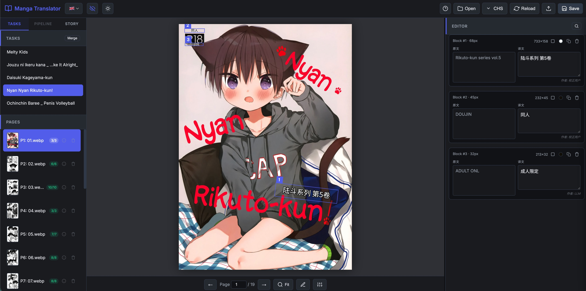

# Manga Image Translator Lite

[English](README.md) | [日本語](README-JP.md) | [中文](README-CN.md)

## Acknowledgements

This project is deeply indebted to **frederik-uni** and **zyddnys** and the original [manga-image-translator](https://github.com/zyddnys/manga-image-translator). This "Lite" version is a modularized and modernized refactor aimed at providing a high-performance, CLI-first experience with human-in-the-loop flexibility.

## Core Differences from Original

1.  **Decoupled Pipeline**: Splits the process into `extract`, `translate`, and `render`. Intermediate results are stored in `pages.json`, allowing manual review or editing before the final render.
2.  **LLM Batching Optimization**: Specifically redesigned for Large Language Models. It batches text blocks across multiple pages to significantly reduce API costs and provide better context for translation.
3.  **Modernized & Optimized**: Fully compatible with Python 3.10+ and optimized for Apple Silicon (MPS/Metal) and NVIDIA (CUDA) acceleration.
4.  **Smart Rendering**: Features a binary-search font fitting algorithm that automatically maximizes font size to fill bubble areas while respecting the original detected boundaries.
5.  **Multi-Task Support**: Automatically handles multiple manga folders as separate "tasks", keeping a clean workspace structure.
6.  **Incremental Translation**: Supports resuming from a specific page and skipping already translated blocks to save time and API costs.
7.  **Spelling & Fluency Proofreader**: Built-in copyediting stage using LLM before rendering to check and correct typos, bad grammar, and translation awkwardness.
8.  **Preserved Newline Layout**: Fully supports explicit newlines (`\n`) for dialog formatting, ensuring preview rendering on browser matches Python typesetting perfectly.

---

Local OCR + third-party LLM API. The pipeline is split into three reviewable steps so you can edit translations by hand before they get rendered back onto the page.

```text
  in/                                   work/                              out/
  ├── manga_a/                          ├── manga_a/                       ├── manga_a/
  │   ├── 0001.jpg  ── extract ──▶    │   ├── pages.json  ── render ──▶ │   ├── 0001.png
  │   └── 0002.jpg                     │   └── clean/                     │   └── 0002.png
  └── manga_b/                          └── manga_b/                       └── manga_b/
      ├── 0001.jpg                          ├── pages.json                     ├── 0001.png
      └── 0002.jpg                          └── clean/                         └── 0002.png
                                                  ▲
                                                  │ translate (LLM API)
                                                  │ + manual edit (Visual Editor)
```

Each subdirectory under `in/` is treated as a separate **task**. The directory structure is mirrored into `work/` and `out/`. Images where no text is detected are passed through unchanged.

## Steps

| Step | What it does | Outputs |
|---|---|---|
| `extract` | text detection → OCR → mask refinement → inpainting | `work/<task>/clean/*.png`, `work/<task>/pages.json` |
| `translate` | batches blocks (~1500 chars), calls LLM, fills `translation` fields. Supports incremental updates. | updated `pages.json` per task |
| `render` | paints translations onto the inpainted images using smart typesetting. Optional copyediting/proofreading check (--check) before rendering. | `out/<task>/*.png` (same count as input) |
| `run` | extract → translate → render in one shot | Both workspace and final images |

Each task's `pages.json` is the single source of truth. Open it between `translate` and `render` to revise any translation.

## Quick start

```bash
pip install -r requirements.txt          # Python >= 3.10
cp config.toml.sample config.toml        # Then fill in [translator] api_key (or use an env var)
cp examples/Example.env .env             # Optional: OPENAI_API_KEY or GEMINI_API_KEY instead

# Single command end-to-end
python -m manga_translator_lite run -i ./in -w ./work -o ./out

# Or step-by-step
python -m manga_translator_lite extract -i ./in -w ./work
python -m manga_translator_lite translate ./work
python -m manga_translator_lite render ./work -o ./out
```

## Command Reference

All commands are invoked as `python -m manga_translator_lite <command> [options]`.

**Common options** (available on `extract`, `translate`, `render`, `run`):

| Option | Description |
|---|---|
| `-c, --config <path>` | Path to the `.toml`/`.json` config file. Defaults to `./config.toml` (or `config.json`) when present. |
| `--target-lang <code>` | Override `translator.target_lang` (e.g. `CHS`, `ENG`, `JPN`, `KOR`). |
| `-v, --verbose` | Verbose logging and intermediate diagnostics. |

### `extract` — Step 1: detection / OCR / inpaint → workspace

| Argument | Description |
|---|---|
| `-i, --input <path>` *(required)* | Input image file, or a directory of images / sub-task folders. |
| `-w, --work-dir <path>` *(required)* | Workspace directory to create or update. |
| `--overwrite` | Re-extract every image even if already present; existing translations are salvaged by spatial IoU matching. |

### `translate` — Step 2: call the LLM and fill in translations

| Argument | Description |
|---|---|
| `work_dir` *(positional, required)* | Existing workspace directory. |
| `--overwrite` | Re-translate blocks that already have translations. Hand-edited blocks (`edited: true`) are preserved. |
| `--start-index <n>` | Start (re)translating from this page index; earlier pages are used as context only. |

### `render` — Step 3: paint translations onto clean images

| Argument | Description |
|---|---|
| `work_dir` *(positional, required)* | Existing workspace directory. |
| `-o, --output <path>` *(required)* | Output directory for final images. |
| `--check` | Force the spelling/fluency proofreading check before rendering. |
| `--no-check` | Skip the proofreading check entirely. |
| `-y, --yes` | Auto-accept and apply all proofreading suggestions. |

### `run` — extract + translate + render end-to-end

Accepts the union of the options above: `-i/--input`, `-w/--work-dir`, `-o/--output` *(all required)*, plus `--overwrite`, `--check`, `--no-check`, `-y/--yes`.

### `config-help` — print the JSON schema of the config file

```bash
python -m manga_translator_lite config-help
```

### Editor server (`server.py`)

| Option | Default | Description |
|---|---|---|
| `-w, --work-dir <path>` | `work` | Workspace directory to serve. |
| `-p, --port <n>` | `8000` | Port to listen on. |
| `--host <addr>` | `0.0.0.0` | Bind address (use `127.0.0.1` to restrict to localhost). |
| `--log-file <path>` | `server.log` | Path to the server log file. |

---

## Configuration

The pipeline reads a single TOML (or JSON) file. The easiest start is to copy the fully-annotated sample and edit it:

```bash
cp config.toml.sample config.toml   # then fill in [translator] api_key
```

`config.toml` is git-ignored, so your key never gets committed. See **[config.toml.sample](config.toml.sample)** for every option with inline comments. All sections are optional; defaults are sensible. A minimal example:

```toml
use_gpu = true

[detector]
detector = "ctd"            # Options: default | dbconvnext | ctd | craft | paddle | none
detection_size = 2048

[ocr]
ocr = "48px"                # Options: 32px | 48px | 48px_ctc | mocr

[translator]
provider = "openai"          # Options: openai | gemini | none
model = "gpt-4o-mini"
api_base = ""                # Empty = provider default, or e.g. https://openrouter.ai/api/v1
api_key = ""                 # Or leave empty and set the OPENAI_API_KEY env var
target_lang = "ENG"
batch_chars = 1500           # ~1000–2000 chars per LLM request
context_pages = 1            # number of past pages sent as tone context

[render]
font_size_offset = 0
font_size_minimum = 34       # Lower bound so small text stays legible
font_size_minimum_expand_limit = 2.5  # Max box growth allowed to host the minimum font size
line_spacing = 0             # Tighten line spacing so more text fits at a larger size
direction = "auto"           # Options: auto | horizontal | vertical
alignment = "auto"
disable_font_border = false  # Keep the outline — key for legibility on any background
# font_color = "000000:FFFFFF"  # Black text + white outline; good for pure B/W books only
```

`provider = "openai"` covers any OpenAI-compatible HTTP endpoint, including DeepSeek, OpenRouter, Groq and Ollama. API keys can live in `[translator] api_key` or in `.env` vars (`OPENAI_API_KEY` / `GEMINI_API_KEY`).

### Choosing a text detector · evaluating RT-DETR (`detector_ab.py`)

The `[detector] detector` option is pluggable: `default`/`dbconvnext` (DBNet), `ctd` (Comic Text Detector), `craft`, `paddle`, `none`, and the experimental **`rtdetr`**.

`rtdetr` wraps the Apache-2.0 Hugging Face model `ogkalu/comic-text-and-bubble-detector` (RT-DETR-v2 r50vd), which detects bubbles / in-bubble text / free text and is good at region typing and grouping on stylized or webtoon/manhua pages. Caveats:

- Needs `transformers` (`pip install transformers`); torch is already a dependency. It is loaded lazily, so the rest of the package is unaffected if you don't use this detector.
- It is a **box detector** — it returns rectangles, not stroke-level masks, so its erase mask is coarser than DBNet/CTD. Keep `ctd`/`default` for production inpainting; treat `rtdetr` as a detection / region-typing experiment for now.
- Try a lower confidence: set `[detector] box_threshold ≈ 0.3`.
- Apache-2.0 covers the code/weights, **not** the (undisclosed) training data — verify provenance before commercial use.

Don't trust anyone's "+X%" claim — measure on your own pages. `detector_ab.py` runs the **detection stage only** through two detectors and reports, per image and in total, how many regions each finds, how much they agree (IoU-matched), and the **A-only / B-only** regions one finds that the other misses; it also writes overlay images (A green, B red) and a `summary.csv`.

```bash
pip install transformers
# pick the pages you're least happy with (webtoon / heavy SFX / dense)
python detector_ab.py ./in/<task> --a ctd --b rtdetr -o ab_out
# then review ab_out/*.png overlays + ab_out/summary.csv
```

There's no ground truth, so the counts are A/B *disagreement* signals, not accuracy — let the overlays and the A-only/B-only buckets drive the call. If RT-DETR clearly wins on your content, adopt it for detection while keeping a mask-producing detector (ctd/default) for erase.

### Controlling text size (`box_scale` · `font_size_minimum` · `font_size_minimum_expand_limit`)

Three knobs decide how big the translated text is rendered, with distinct, non-overlapping roles:

- **`box_scale`** *(per-task — set in the editor, stored in `pages.json`)* — the main magnifier. It scales each text box **and** the font-size ceiling by the same factor, so `2.5` renders text ~2.5× the detected size and fills the enlarged box (not just adds whitespace). A per-block `scale_exempt` flag opts a single block out.
- **`font_size_minimum`** *(config `[render]`)* — a pure lower bound (pixels) for legibility. Text only shrinks below the box_scale'd size when a long translation must fit, and never below this floor (hand-adjusted boxes use a 4 px floor).
- **`font_size_minimum_expand_limit`** *(config `[render]`)* — a fallback only. If a long translation still doesn't fit the box_scale'd box even at `font_size_minimum`, the box is expanded further, up to this ratio.

Typical workflow: set `box_scale` per task for the overall size you want; leave `font_size_minimum` as a legibility floor and `font_size_minimum_expand_limit` as overflow headroom. Boxes you adjust by hand in the editor render exactly as drawn (never auto-expanded). The editor preview uses the same formulas, so what you see matches the output.

## Visual Editor (Experimental)

A lightweight web-based visual editor `editor.html` is provided for a better manual review experience.


*Example of the Visual Editor (editor.html) in action.*

- **Light / Dark theme**: toggle in the header (remembered across sessions). The canvas uses a neutral grey backdrop so white / black-and-white pages are easy on the eyes.
- **Real-time Preview**: see how the translated text looks on the actual page as you type.
- **Side-by-side original / translation**: each block shows the source text next to an editable translation field for easy comparison.
- **Translation progress at a glance**: per-page `done/total` badges, plus amber highlighting of untranslated blocks on the page list, the canvas tags, and the editor cards.
- **Page thumbnails**: the page list shows lazy-loaded thumbnails (server mode serves cached thumbnails via `api/thumb`).
- **Search & replace**: search across all pages of a task and replace within translations (magnifier button in the editor header).
- **Import / Export translations**: import an external `translations/*.json` and diff it entry-by-entry; export the current language's translations (export shown in server mode).
- **Keyboard Shortcuts**: `←`/`→` page; `↑`/`↓` move between blocks / tasks / pages depending on the focused pane; `Alt`+`←`/`→` page even while editing text; `Alt`/`Ctrl`+`Z` clear the current translation; `?` opens the full shortcut help.
- **Shortcut Focus Routing**: `↑`/`↓` adapt to the active pane — Tasks list, Pages list, dialogue editor (block navigation), or canvas (scroll when zoomed).

### How to Use:
There are three ways to open the editor:
1. **Serverless Local Mode**: Open `editor.html` directly in your browser. Click **Open** to select your `work` folder. (Requires Chrome/Edge, uses the modern HTML5 File System Access API for local reads/writes).
2. **Standalone Server Mode**: Run `python server.py -w ./work`, then open one of the per-task URLs the console prints (each ends with `?t=<token>`). See [Standalone Backend Server](#standalone-backend-server-serverpy).
3. **Authenticated Multi-user Mode**: Run `python server_auth.py -w ./work` for X (Twitter) login with per-user view/edit permissions. See [Multi-user server](#multi-user-server-with-x-login-server_authpy).

### Editor tools (regions, pages, merge)

The editor is more than a translation textbox — it can fix layout and geometry directly:

- **Region editor** — click the pencil (region-edit) button in the bottom toolbar to unlock boundary editing; a hint banner stays on screen while it's active. Then:
  - **Resize** a region by dragging its handles, **move** it by dragging the body — the cursor shows which action you'll get.
  - **Draw a new region** by dragging on an empty area (new regions get a white background by default).
  - The **blue box** is the detected text region (where the translation is fitted); the **green dashed box** shows the actual rendered text extent, so you can size the box to control how big the text appears in the bubble. Untranslated blocks are tagged in amber.
  - A hand-adjusted box is marked *fixed* — at render time the text is fitted into exactly that box and is **never auto-expanded**.
- **Render settings popover** — a gear button in the toolbar opens per-task render controls: **box scale**, **min font size**, and **expand limit** (written to `pages.json`; see [Controlling text size](#controlling-text-size-box_scale--font_size_minimum--font_size_minimum_expand_limit)).
- **Per-block background** — each block card has a background toggle: **white** paints a white rectangle behind the text (covers leftover/original content), **transparent** renders text only. A delete button removes the block.
- **Page management** — each page row has an info button (file-path & metadata popup) and a delete button (removes the page and cleans up its blocks, translations in every language, and its clean image; double confirmation).
- **Task merge** — click **Merge**, tick tasks in the order you want them joined (an order badge 1·2·3 appears), then **Confirm**. Pages are renamed sequentially so the merged output keeps one continuous reading order.
- **Import / Export translations** — the import button diffs an external translations file (e.g. `translations/CHS.json`) against the current language entry-by-entry. **Only differences are shown** (identical entries are ignored); tick which to apply (current in red, imported in green) or select all; applied changes are saved automatically. It warns if the file's language differs from the one you're editing. In **server mode** an export button downloads the current language's translations as `<LANG>.json`.

Geometry edits (region/box/render-settings) save to `pages.json` immediately; translations save with the **Save** button (an unsaved-changes dot appears until you do). Re-run `render` to produce the final images.

---

## Standalone Backend Server (`server.py`)

In addition to serving static files, this project includes a standalone backend server (`server.py`) to manage task data, synchronize story descriptions, and execute pipelines directly from your browser.

### 1. Key Features
* **Web-based Pipeline Runner**: Trigger `Extract`, `Translate`, `Render`, or the full sequential pipeline (`Run`) directly from the visual editor browser page, with live terminal logs streamed back via Server-Sent Events (SSE).
* **Automated Data Syncing**: Save page data, manual translation edits, and story contexts (`story.txt`) directly to your disk, bypassing standard browser security sandboxing.
* **Token-based Security**: Automatically generates robust access tokens for each task directory to prevent unauthorized data manipulation.

### 2. Usage
Run the server pointing to your active workspace:
```bash
python server.py -w ./work -p 8000
```
The console prints a secure URL for each task (each ends with `?t=<token>`); open one to edit that task. The server also serves cached page thumbnails (`api/thumb`) and reports pipeline availability to the editor (the Pipeline tab is disabled if `manga_translator_lite` isn't importable on the server).

---

## Multi-user server with X login (`server_auth.py`)

For a shared deployment where different people should only see (or edit) certain tasks, use `server_auth.py` instead of `server.py`. It serves the same editor and endpoints but adds:

* **X (Twitter) login** via OAuth 2.0 (Authorization Code + PKCE), with cookie sessions.
* **Per-user permissions** from an `access.json` file — each X handle gets `view` and/or `edit` task lists (`"*"` = all tasks; `edit` implies `view`; hot-reloaded on change).
* **Server-enforced read-only**: view users get a read-only editor (mutating controls hidden, a *Read-only* badge shown) and every write request is rejected with `403` regardless of the client.

```bash
export X_CLIENT_ID=...  X_CLIENT_SECRET=...  X_REDIRECT_URI=http://localhost:8000/auth/callback
cp access.json.sample access.json    # then list your users
python server_auth.py -w ./work -p 8000
```

Open `http://localhost:8000/` → **Login with X** → pick a task you're permitted. Full setup (X app, env vars, access file, HTTPS deployment, permission model) is documented in **[SERVER_AUTH.md](SERVER_AUTH.md)** and in the Chinese config comments at the top of `server_auth.py`. `server.py` remains the no-auth option.

---

## Translation Review & Story Context Management

To address inconsistency in tone and lack of context when translating long or continuous manga chapters in batches, this project introduces the **Story-Context-Aware Translation Review and Polish (Review)** feature during the `translate` stage.

### 1. Mechanism & Idempotency
* **Review & Polish**: After completing the initial translation, the pipeline automatically compiles all translated blocks in chronological reading order, then invokes the LLM to polish them based on the **overall story description** for consistency and character voice.
* **Idempotency**: A `<lang>.reviewed` marker file (e.g. `CHS.reviewed`) is created in the `translations/` folder upon a successful review. Subsequent `translate` runs will skip both translation and review.
* **Incremental Run**: If a task is fully translated but not yet reviewed, running `translate` will skip the translation phase and **incrementally run the review step**; using the `--overwrite` flag forces both re-translation and re-review.

### 2. Story Context File (`story.txt`)
Simply place a text file named `story.txt` (or `script.txt`, `description.txt`) in your task folder (e.g. `work/task_a/`). The program will automatically search for it. You can also specify it in `pages.json` under the `"story"` key.
Write character bios, relationship details, and style/tone notes in it. The LLM will leverage this outline to perform highly immersive, consistent translations.

### 3. Visual Story Editor & Prompts
Story context management has been fully integrated into the **Visual Editor (`editor.html`)**:
* **New Story Tab**: A sidebar "Story" tab has been added to write, edit, and save `story.txt` on the fly.
* **Genre-based Templates**: Built-in multi-lingual (EN/ZH/JA) genre templates (Daily Romance, Fantasy Adventure, Gag/Comedy, Mature/Adult 18+) to bootstrap context writing.
* **Serverless Local Writing**: Utilizing the HTML5 File System Access API, it saves `story.txt` directly to your local workspace disk without needing any active backend server process. It also automatically synchronizes via API when running in `server.py` mode.

### 4. Anti-Censorship Disclaimer
To prevent LLMs (e.g. DeepSeek, Gemini) from rejecting adult or mature manga during translation, a standard English disclaimer ("All characters depicted in the work are entirely fictional and over 18 years old...") is embedded in the system-level prompts, ensuring a smooth translation pipeline.

---

## Translation Spelling & Fluency Proofreading Check

To ensure translations are natural, direct, and free from awkward phrasing or typos, this project includes a **Spelling and Fluency Proofreading Check (Copyediting)** step before rendering.

### 1. Mechanism
* The proofreader sends translated text blocks to the LLM in batches for copyediting.
* It strictly checks for typos, grammatical errors, and awkward phrasing, while completely ignoring punctuation differences to minimize unnecessary updates.
* Changes are presented in a clean table format indicating the original text, current translation, suggestion, and the reason.

### 2. Interaction Modes
When rendering (`render` or `run` command), you can choose how to review recommendations:
* **Interactive Mode (Default on TTY)**: Prompts you to review each recommendation one by one. You can accept, reject, or manually edit (`e`) the inline text.
* **Auto-Apply (`--check -y` or `--check --yes`)**: Automatically accepts and applies all LLM copyediting recommendations without prompting.
* **Force / Bypass**: Use `--check` to force proofreading, or `--no-check` to bypass the proofreading step entirely.

---

## Fixing residual text (`reclean.py`)

Sometimes inpainting leaves bits of the original text around a bubble (faint symbols or handwritten kana that OCR rejected). `reclean.py` re-erases those **without** re-running the whole pipeline — translations and their positions are untouched.

```bash
# Drift-free: re-detect residual text on the clean images and erase it.
# Blocks and translations are NOT modified (no position drift).
python reclean.py work/<task> --redetect

# Then re-render
python -m manga_translator_lite render work/<task> -o out
```

| Option | Description |
|---|---|
| `--redetect` | Re-detect residual text on the clean image and erase it; never touches blocks/translations. Best when your detector config changed since extraction. |
| `--pages 3,7` | Only these pages (1-based, as shown in the editor). |
| `--dilation <px>` | Geometry-mode mask growth (default 35). Ignored with `--redetect`. |
| `--backup` / `--no-backup` | Snapshot each task's `clean/` to a versioned `clean.bak.NNN` before editing (default: on). |
| `--max-backups <n>` | Keep at most N backup versions per task. |

It reads the same `config.toml`, so tuning `[detector]` (e.g. lower `text_threshold`, enable `det_gamma_correct`) improves what it catches.

> The `extract` step now erases **every detected region** — including symbols/handwriting that the translation rules reject — and records the rejected ones as `erase_regions` in `pages.json`. So a fresh `extract --overwrite` already cleans most residue; `reclean.py` is for touching up existing tasks.

---

## Editing translations

After `translate`, each task's `pages.json` looks like:

```json
{
  "version": 2,
  "target_lang": "ENG",
  "task_name": "manga_a",
  "pages": [
    {
      "index": 0,
      "name": "0001.jpg",
      "size": [1200, 1700],
      "clean": "clean/0000_0001.png",
      "blocks": [
        {
          "id": "p0000_b000",
          "text": "おはよう",
          "translation": "Good morning",
          "bbox": [120, 340, 80, 40],
          "polygon": [[120,340],[200,340],[200,380],[120,380]],
          "font_size": 24
        }
      ]
    },
    {
      "index": 1,
      "name": "0002.jpg",
      "no_text": true,
      "blocks": []
    }
  ]
}
```

### Re-translating & Resuming

Lite supports smart incremental updates and resuming:

```bash
# Re-translate from index 10 onwards
python -m manga_translator_lite translate ./work --start-index 10

# Force re-translate everything (overwrites existing translations)
python -m manga_translator_lite translate ./work --overwrite
```

## Project layout

```text
manga_translator_lite/
  pipeline/        # Core CLI steps (extract, translate, render, run)
  translators/     # Unified LLM clients (OpenAI-compatible, Gemini)
  rendering/       # Smart typesetting and font fitting
  detection/       # Text detection modules
  ocr/             # Local OCR wrappers
  ...
```

## Usage

Recommended setup using a virtual environment:

```bash
python -m venv venv
source venv/bin/activate      # Linux / macOS
venv\Scripts\activate         # Windows

pip install -r requirements.txt
cp examples/Example.env .env  # Configure your API keys
```

## License

GPL-3.0-only. See [LICENSE](LICENSE).
